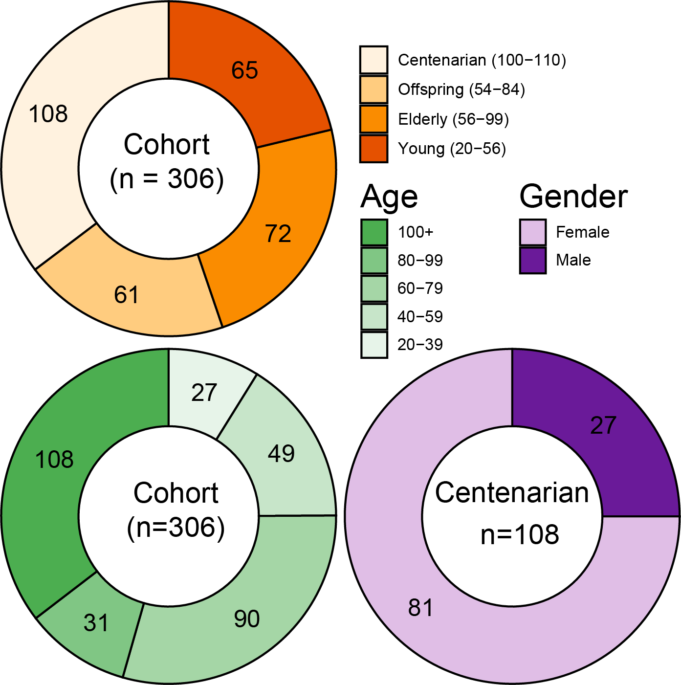
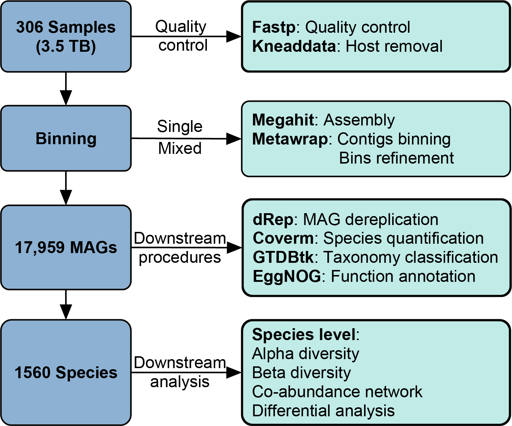
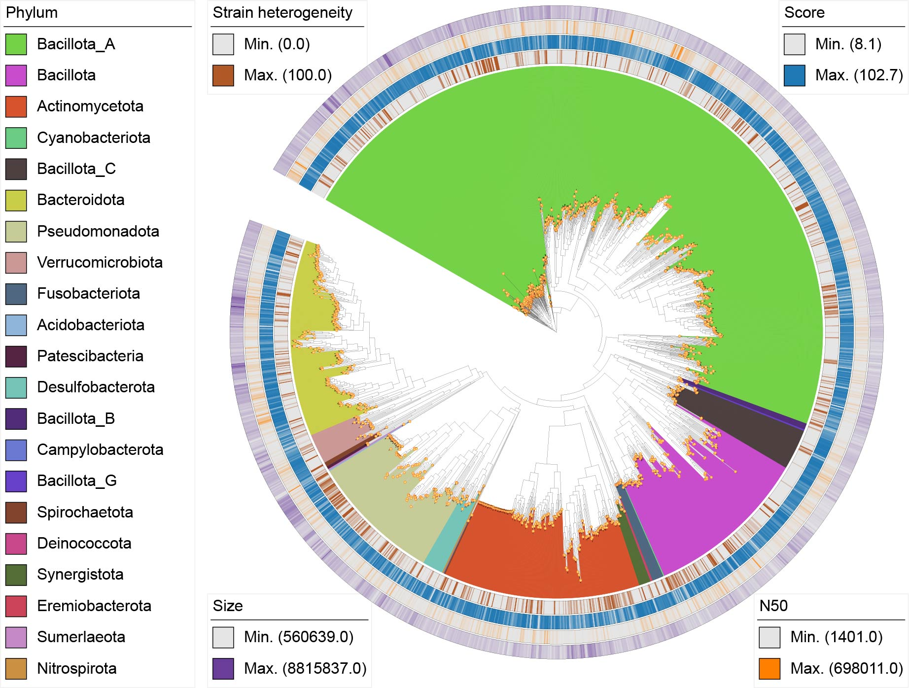
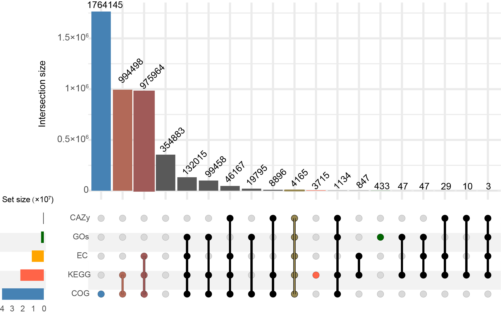
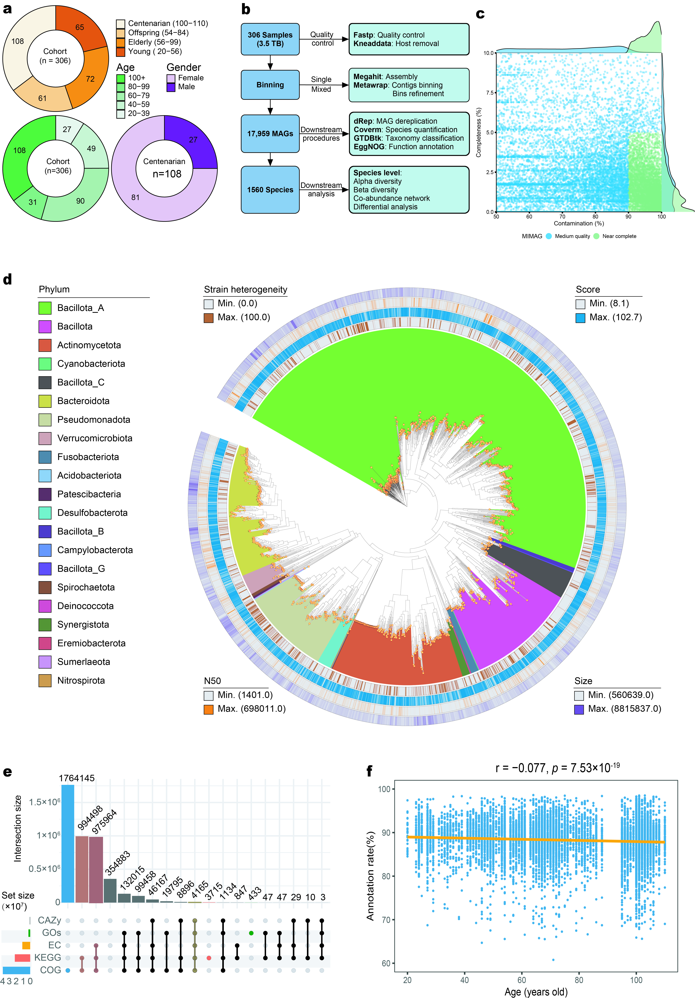

```{r setup, include = FALSE}
knitr::opts_chunk$set(
  collapse = T, echo=T, comment="#>", message=F, warning=F,
	fig.align="center", fig.width=5, fig.height=3, dpi=150)
```


## Fig. 1A. Sample attribution

Population, gender and age distribution

```{r Sample information}
# package check
p_list = c("ggplot2","paletteer", "BiocManager", "devtools")
for(p in p_list){if (!requireNamespace(p)){install.packages(p)}
    library(p, character.only = TRUE, quietly = TRUE, warn.conflicts = FALSE)}
# package load
library(paletteer)
library(ggsci)
library(scales)
library(dplyr)
library(ggplot2)
library(patchwork)
# data load
df<-read.table("./data_fig1/metadata.txt",header=T, sep = "\t")
which(is.na(df$Group))
N<-nrow(df)
NC<-nrow(subset(df,df$Group=="C"))
NL<-nrow(subset(df,df$Group=="L"))
NE<-nrow(subset(df,df$Group=="E"))
NY<-nrow(subset(df,df$Group=="Y"))
# Gender
Cohort_Male<-nrow(subset(df,df$Gender=="Male"))
Cohort_Female<-nrow(subset(df,df$Gender=="Female"))
# Gender_centenarian
NC_Male<-nrow(subset(df,df$Group=="C" & df$Gender=="Male"))
NC_Female<-nrow(subset(df,df$Group=="C" & df$Gender=="Female"))
# 人群年龄分布
NC_20_40<-nrow(subset(df,df$Age >= 20 &df$Age < 40))
NC_40_60<-nrow(subset(df,df$Age >= 40 & df$Age <60))
NC_60_80<-nrow(subset(df,df$Age >= 60 & df$Age < 80))
NC_80_100<-nrow(subset(df,df$Age >= 80 & df$Age < 100))
NC_over_100<-nrow(subset(df,df$Age >=100))
# Age distribution
Age_distribution_Centenarians<-data.frame(C_Num=c(NC_20_40,NC_40_60,NC_60_80,NC_80_100,NC_over_100),group=c("20-39","40-59","60-79","80-99","100+"))
Age_distribution_Centenarians$group<- factor(Age_distribution_Centenarians$group,levels=c("100+","80-99","60-79","40-59","20-39"))
# Age distribution circular plot
# Hole size
hsize <-2
df<- df %>%
  mutate(x=hsize)
p1 = ggplot(Age_distribution_Centenarians,aes(x=hsize,y=C_Num,fill=group))+
  geom_col(color="black")+
  coord_polar(theta="y")+
  scale_fill_manual(values=c("100+"="#4CAE50FF","80-99"="#80C684FF","60-79"="#A5D6A6FF","40-59"="#C7E5C9FF","20-39"="#E7F4E9FF"),name="Age",5)+
  xlim(c(.5,hsize+.5))+
  geom_text(aes(label=C_Num),position=position_stack(vjust=.5))+
  theme_void()+
  ggtitle(paste0("Age\n n=",N))+
  theme(legend.position = "right")
p1
ggsave("Fig.1A-age.pdf", p1, width = 90, height = 90, units = "mm")
################################################################
# Gender circular plot of the centenarians
library(ggplot2)
Gender<-data.frame(value=c(NC_Male,NC_Female),group=c("Male","Female"))
# Hole size
hsize <-2
df<-df %>%
  mutate(x=hsize)
p2=ggplot(Gender,aes(x=hsize,y=value,fill=group))+
  geom_col(color="black")+
  coord_polar(theta="y")+
  scale_fill_manual(values=c("#E0BEE6FF","#6A1A99FF"),name="Gender",2)+
  xlim(c(.5,hsize+.5))+
  geom_text(aes(label=value),position=position_stack(vjust=.5))+
  theme_void()+
  theme(legend.position ="right")+
  ggtitle(paste0("Gender\n n=",NC))
p2
ggsave("Fig.1A-gender.pdf", p2, width = 90, height = 90, units = "mm")
################################################################
# Age distribution of the populations
library(ggplot2)
library(dplyr)
Cohorts_age_distribution<-data.frame(value=c(NC,NL,NE,NY),
                                     group=c("Centenarian(100-110)",
                                             "Offspring(54-84)",
                                               "Elderly(56-99)","Young(20-56)"))
# Hole size
hsize <-2
df<-df %>%
  mutate(x=hsize)
p3=ggplot(Cohorts_age_distribution,aes(x=hsize,y=value,fill=group))+
  geom_col(color="black")+
  coord_polar(theta="y")+
  scale_fill_manual(values=c("#FFF2DFFF","#FFCC7FFF","#FA8C00FF","#E55100FF"),name="Cohort",5)+
  xlim(c(.5,hsize+.5))+
  geom_text(aes(label=value),position=position_stack(vjust=.5))+
  theme_void()+
  theme(legend.postion = "right")+
  ggtitle(paste0("Cohort\n n=",N))
p3
ggsave("Fig.1A-Group.pdf", p3, width = 83, height = 75, units = "mm")

p<-wrap_plots(A=p3,B=p1,C=p2,design="A#
                                    BC")
par(mar = c(5, 4, 4, 2) + 0.1) 
ggsave("Fig.1A.pdf", p, width = 183, height=118, units = "mm")

```
```{r load the figure. 1A}
# load the ready graph of Fig.1A

```

## Fig. 1B. MAG assembly
This figure is a diagram about the pipeline to get MAGs and the downstream species differential analysis. We just used a software called 'ClickCharts' to draw it. 

```{r load the figure. 1B}
# load the ready graph of Fig.1B

```


## Fig. 1C. MAG quality distribution

Medium- & high-quality bins

This is retrieved from CheckM V.1.0.1, which could be further combined with the presence of 5S rRNA, 16S rRNA , 18S rRNA information of MAGs detected using barrnap and tRNAscan-SE softwares.

```{r MAG quality distribution}
# load libraries
library(ggplot2)
library(cowplot)
library(dplyr)

# load data
checkm.dat = read.table("data_fig1/MAG_17959_genomes.txt", sep="\t",header=T,stringsAsFactors = FALSE)
checkm.dat$MIMAG = ifelse(checkm.dat$Completeness > 90 & checkm.dat$Contamination < 5, "Near complete", "Medium quality")

checkm.dat$MIMAG[which(checkm.dat$Completeness<50 | checkm.dat$Contamination > 10)]="Low quality"
checkm.dat$MIMAG = factor(checkm.dat$MIMAG, levels=c("Medium quality", "Near complete"))
checkm.dat<- as.data.frame(checkm.dat)
# write.table(checkm.dat, file = "checkm.dat.tsv", row.names = FALSE, sep = "\t")
###############################################
Near_complete<- checkm.dat %>% filter(MIMAG == "Near complete")
dim(Near_complete)
Medium_quality<- checkm.dat %>% filter(MIMAG == "Medium quality")
dim(Medium_quality)
################################################
# plots
# mimag_levels <- levels(factor(checkm.dat$MIMAG))
# jco_colors <- ggpubr::get_palette("jco", length(mimag_levels))
jco_colors<-c("#389ED6","#80C684FF")

theme_set(theme_half_open())
scatter.plot = ggplot(checkm.dat, aes(x=Completeness, y=Contamination, color=MIMAG)) + 
  guides(colour = guide_legend(override.aes = list(size=5, alpha=0.8)))+
  geom_point(size=0.6, alpha=0.4)+
  scale_x_continuous(limits = c(50, 100), expand = c(0, 0)) +  #
  scale_y_continuous(limits = c(0,10), expand = c(0, 0))+
  scale_color_manual(values = jco_colors)+
  theme(legend.position = "bottom")+
  xlab("Contamination (%)")+
  ylab("Completeness (%)")

comp.dens = axis_canvas(scatter.plot, axis="x") + 
  geom_density(data = checkm.dat, aes(x=Completeness, fill = MIMAG),alpha=0.5,size=0.2) + 
  geom_vline(xintercept = median(checkm.dat$Completeness), linetype="dashed")+
  scale_fill_manual(values = jco_colors)
  

cont.dens = axis_canvas(scatter.plot, axis = "y",coord_flip=TRUE) + 
  geom_density(data=checkm.dat, aes(x=Contamination, fill = MIMAG),alpha=0.5,size=0.2) + 
  geom_vline(xintercept = median(checkm.dat$Contamination), linetype="dashed")+
  coord_flip()+
  scale_fill_manual(values = jco_colors)

p1 <- insert_xaxis_grob(scatter.plot, comp.dens, grid::unit(.2, "null"), position = "top")
p2 <- insert_yaxis_grob(p1, cont.dens, grid::unit(.2, "null"), position = "right")
p3<-ggdraw(p2)
p3
ggsave(p3, file="Fig.1C.pdf", width=183, height=183, units = "mm")

```

## Fig. 1D. Phylogenetic tree with annotations of the species-level gut microbiome (bacteria) of the Cohort.

This figure is produced through the iTOL website by providing the tree file of the 1543 representative bacterial species and their annotation metadata table: these files are located in the present directory named "tree/itol"
https://itol.embl.de/

```{r load the tree of the representative genomes}
# load the ready graph of Fig.1D

```


## Fig. 1E. Functional annotation of genes in MAGs

We provide the eggNOG-mapper annotated files, in which the genes with annotation in 5 databases (COG, KEGG, EC, GO, CAZy) were replaced with 1, the genes without annotation item in the five database were replaced with 0, which followed by a data visualization.

Due to the file 'eggnogAnno01.txt' with a size of 1.85Gb, we need use Rstudio & R installed in the sever to help us visualize the results, this may take minutes to hours.

You can find this file and R code for data visualization under this directory "data_fig1/upset"
```{r Functinal annotation of genes in MAGs, eval = FALSE}
df<-read.table("eggnogAnno01.txt",header=T,row.names=1)
# The original eggnogAnno01.txt file should execute: df$colnames<-ifelse(df$colnames=="-",0,1)
df$Genes<-paste0("G",1:nrow(df))
rownames(df)<-paste0("G",1:nrow(df))
# colnames(df)<-c("COGs","GOs","EC","KEGG","CAZy","Genes")
df<-data.frame(df)
db<-colnames(df)[1:5]
db
library(ggplot2)
library(ComplexUpset)
df[db]=df[db]==1
t(head(df[db],3))
df[df$Genes=="","Genes"]=NA
###############
set_size = function(w, h, factor=1.5) {
  s = 1 * factor
  options(
    repr.plot.width=w * s,
    repr.plot.height=h * s,
    repr.plot.res=100 / factor,
    jupyter.plot_mimetypes='image/png',
    jupyter.plot_scale=1
  )
}
#####################
set_size(8,3)
p1<-upset(df,db,width_ratio = .1,sort_sets="ascending")
ggsave("fig1E.pdf",p1,width = 183,height = 119,units="mm")
```

```{r load the final fig.1E}
# load the ready graph of Fig.1E

```

## Fig. 1F. The dynamics of gene annotation rate in 5 the databases in the gut of different people.

We associate the annotation rate of MAG genes with age based on the original source of MAGs. These MAGs (only 13,390 MAGs)are assembled through binning procedures originated from single samples binning scheme.

file position:(D:/AAProject/MAG/seq/MAG-diff/eggnog_annotation_with_age_correlation)
```{r Genes annotation rate of MAGs with the aging process}
library(readxl)
library(Hmisc)
library(ggplot2)
Data<-read.delim("data_fig1/MAG_Anno_clean.txt",stringsAsFactors = FALSE,sep="\t")
Dat <- na.omit(Data)
Dat$Unannotation <- (Dat$Total - Dat$EggNOG + Dat$Unknow5)
Dat$Unannotation_rate <- Dat$Unannotation/Dat$Total
Dat$Annotation_rate<-100*(1-Dat$Unannotation_rate)

# Calculate the p-value and the correlation coefficient
res <- rcorr(Dat$Age, Dat$Annotation_rate)
p_value <- round(res$P[1,2],300)
cor_value <- round(res$r[1,2], 3)
p<-ggplot(Dat,aes(Age, Annotation_rate))+
  geom_point(color = "steelblue", size= 0.4)+
  geom_smooth(method = "lm", formula = y ~ x, 
              # Set the colors for the confidence interval and the fitted line
              fill = "#b2e7fa", color = "orange", alpha = 0.8)+
  theme_bw()+
  scale_x_continuous(breaks=seq(from=20,to=112,by=20))+
  # xlim(20,112)+
  ylim(60,100)+
  theme(
    # remove the gridlines
    panel.grid = element_blank(),
    # set the axis title
    axis.title = element_text(face = "plain"),
    # set the main position to middle
    plot.title = element_text(hjust = 0.5)
  )+
  labs(x="Age (years old)",y="Annotation rate(%)",title = paste0("r = ", cor_value, ", p = ", p_value))
p
ggsave("fig1F.pdf", p, width = 89*1.5, height = 59*1.5, units = "mm")

```

```{r load the final figure1}
# load the ready graph of figure1

```
## Package information
```{r}
sessionInfo()
```


